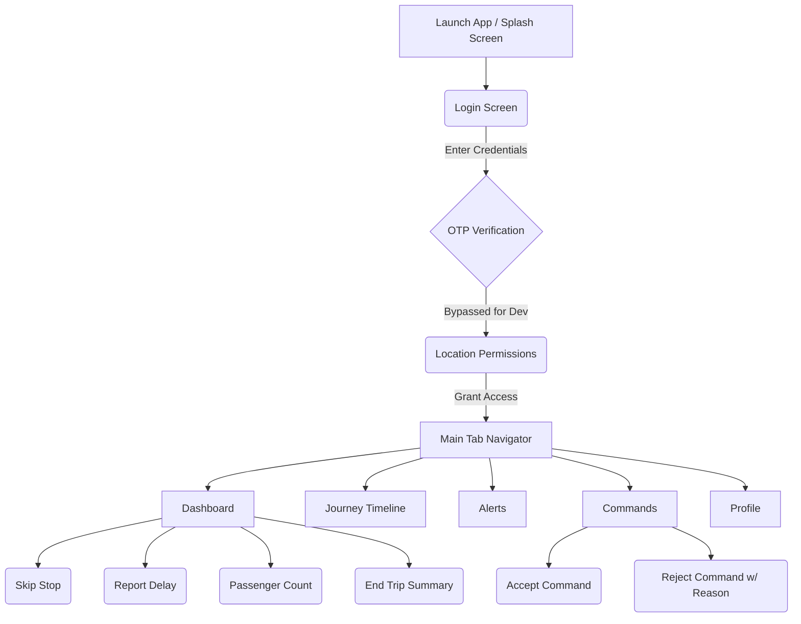
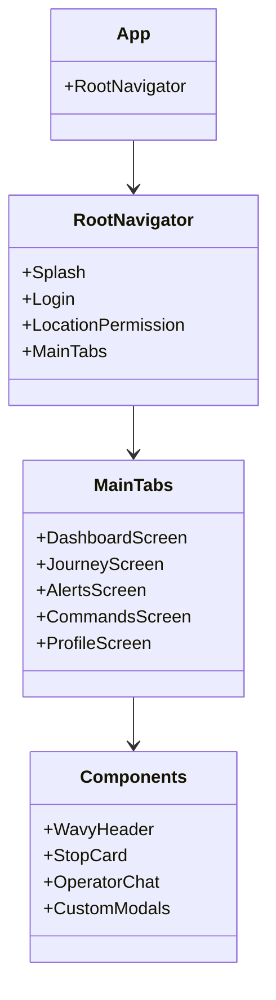

# Raah Conductor App

Welcome to the **Raah Conductor App**, a modern, responsive React Native (Expo) application designed to empower bus conductors and public transit operators. This application provides real-time journey tracking, seamless communication with the control room, and intuitive tools for managing passenger flow and trip events.

## 🚀 Overview

The Raah Conductor App is a critical piece of the public transit ecosystem. It replaces legacy manual ticketing and reporting systems with a sleek, digital-first interface. Built with a focus on speed, clarity, and reliability, the app ensures that conductors can focus on passenger safety and service quality while staying perfectly in sync with the central operator.

### Key Features
- **Live Dashboard**: Real-time tracking of the current journey, upcoming stops, and ETA.
- **Operator Commands**: Receive high-priority commands from the control room (e.g., "Hold Bus") with instant Accept/Reject workflows.
- **Incident Reporting**: One-tap tools for reporting delays, skipping stops, and simulating operator chat.
- **Passenger Management**: Easy input forms for updating passenger counts at stops.
- **End-of-Trip Summaries**: Automated generation of trip statistics (duration, stops, distance, passenger count).
- **Profile & Preferences**: Customizable settings, including notification toggles and compliance documentation access.

---

## 🗺️ User Workflow



1. **Authentication**: The user signs in using their Employee ID. (Note: For development, OTP verification is bypassed to speed up testing).
2. **Permissions**: The app requests location permissions to track the bus's live coordinates.
3. **Dashboard Management**: The primary view. Conductors can see the next stop, report delays, skip stops, or message the operator.
4. **Command Handling**: If an emergency or dispatch update occurs, the conductor receives a command in the Commands tab and must accept or clarify it.
5. **Trip Completion**: Pressing "End Trip" swaps the Dashboard to a beautiful "Trip Completed" summary view, where the conductor can review stats and end their shift.

---

## 🏗️ Architecture

The app follows a modular and scalable React Native architecture, utilizing React Navigation for routing and context management.



- **Routing Layer (`src/navigation`)**: Handles all stack and tab navigation (`@react-navigation/native`).
- **Screen Layer (`src/screens`)**: Contains the primary views corresponding to different states of the application.
- **Component Layer (`src/components`)**: Reusable UI elements (Headers, Cards, Modals) designed for high reusability.
- **Asset Management (`src/assets`)**: Houses all SVGs, generated 3D mascot images, and custom fonts.

---

## 💻 Developer Guide: Replicating & Running the Project

Follow these steps to get the project running on your local machine.

### Prerequisites
- [Node.js](https://nodejs.org/en/) (v18 or higher recommended)
- [Git](https://git-scm.com/)
- [Expo CLI](https://docs.expo.dev/get-started/installation/) (`npm install -g expo-cli`)
- A physical device with the **Expo Go** app installed (iOS/Android), or an iOS Simulator / Android Emulator.

### 1. Clone the Repository
```bash
git clone https://github.com/Prince-Vaviya/raah-c.git
cd raah-conductor
```

### 2. Install Dependencies
```bash
npm install
```
*Note: This project relies on standard Expo packages and `lucide-react-native` for beautiful vector icons.*

### 3. Start the Development Server
```bash
npm run start
```
or 
```bash
npx expo start --clear
```
*(The `--clear` flag ensures the Metro bundler cache is wiped, preventing stale code issues during rapid development).*

### 4. Run on Device
- **Physical Device**: Scan the QR code displayed in the terminal using the Expo Go app.
- **iOS Simulator**: Press `i` in the terminal.
- **Android Emulator**: Press `a` in the terminal.

### 5. Using the App
- When presented with the **Login** screen, you can use the default placeholder `KA-BUS-4821` and any password.
- Tapping **Login** will bypass the OTP screen and take you directly to Location Permissions -> Dashboard.
- **Test the UI**: Tap the bottom tabs, try "End Trip" on the dashboard, accept a command in the Commands tab, or toggle settings in the Profile tab.

---

## 🎨 Design System
- **Colors**:
  - Primary Blue: `#4285F4`
  - Success Green: `#10B981`
  - Danger Red: `#EF4444`
  - Warning Yellow: `#EAB308`
  - Background Light Blue: `#F0F8FB`
- **Typography**: Clean, modern system sans-serif fonts with distinct font weights for hierarchical clarity.
- **Icons**: [Lucide React Native](https://lucide.dev/) for consistent, lightweight, and scalable iconography.

---

### Built with ❤️ for public transit.
